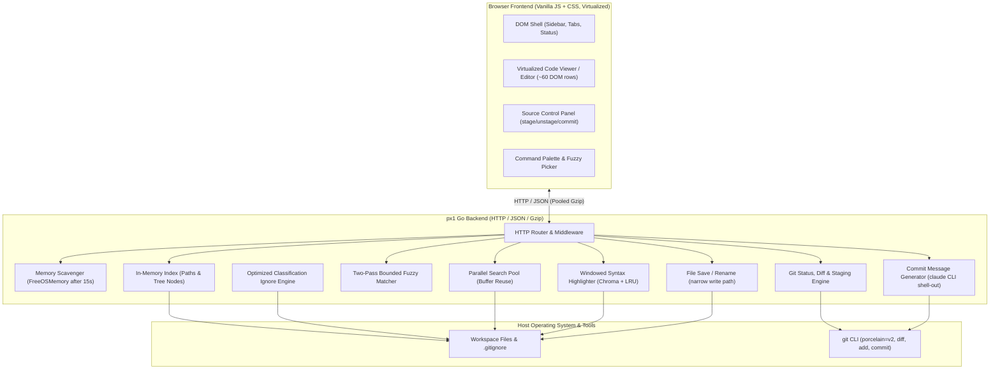

# px1 Internal Architecture & Design Documentation

Welcome to the internal engineering documentation for px1, an ultra-lightweight, zero-config code reader and editor, packaged as a single statically-linked binary.

This directory contains in-depth technical write-ups explaining how px1 achieves sub-millisecond startup, instantaneous file navigation, and a minimal memory footprint (~20 MB RSS) across codebases containing tens of thousands of files.

## 1. Subsystem Architecture Map

## 2. Documentation Directory

The internal documentation is modularized into the following focused guides:

### Core Architecture & Server Runtime

- [System Architecture & Runtime Lifecycle](architecture.md): High-level architectural tenets, single-binary distribution, sub-millisecond startup sequence, HTTP router and endpoints, proactive memory scavenging (`debug.FreeOSMemory()`), and path sandboxing.
- [Filesystem Indexing & Ignore Engine](indexing-and-ignore.md): Bounded-concurrency directory traversal (`NumCPU * 4`), instant root availability, symlink cycle immunity, and the custom classification-based `.gitignore` engine.
- [Performance & Comparative Benchmarks](../../BENCHMARKS.md): Measurement methodology across the 7-repository test corpus (Flask to the Linux Kernel) and side-by-side memory/CPU comparison against the VS Code process tree.

### Search & Intelligence Engines

- [Fuzzy Path Matching](fuzzy-search.md): Two-pass bounded search algorithm ($O(N)$ scan time matching dynamic programming ranking accuracy), weighted scoring matrix, and parallel query slicing.
- [Workspace Search](workspace-search.md): Multi-core parallel grep, buffer reuse (`workBuf`), whole-file rejection fast paths (`bytes.Contains`), and smart snippet elision (`{Pre, Mid, Post}`).
- [Windowed Syntax Highlighting](syntax-highlighting.md): Solving Chroma lexer bottlenecks with viewport-based windowing (`hlChunk = 1000`), byte-capping (`512 KB`), dual-tier tokenization (instant inexact window + background exact pass), and byte-budgeted LRU caching.
- [Git Awareness & Diffing](git-integration.md): CLI shell-out architecture, concurrent status generation with indexing, ancestor folder dirty propagation, gutter diff parsing, and the client-side split diff renderer.

### Frontend & UI Subsystems

- [Editor Virtualization & Caret Engine](editor-virtualization.md): Custom ~60-row DOM virtualization, offscreen sub-pixel font measurement, selection preservation across repaints, decoupled overlay caret, and in-place editing.
- [File Updates & In-Place Tab Reloading](file-reload-and-updates.md): End-to-end flow for workspace reindex and tab refreshing, in-place document reconciliation, concurrent chunk fetches, live viewport scroll snapshotting, and file shrinkage handling.
- [Theme Architecture & CSS Tokens](styling-and-themes.md): CSS custom property token architecture, zero literal colors in `style.css`, dynamic stylesheet discovery at `/static/themes.css`, and custom theme authoring.

### Operations & Maintenance

- [User Features Documentation](../features/README.md): High-level feature guides, practical workflows, and keyboard shortcuts for all px1 capabilities.
- [AI Agent Operational Guidelines](../agents/README.md): Engineering principles for AI coding agents, mandatory documentation maintenance protocol, and frontend codebase index.
- [Publishing & Release Guide](../../PUBLISHING.md): Step-by-step instructions for preparing, testing, and publishing new px1 releases.
