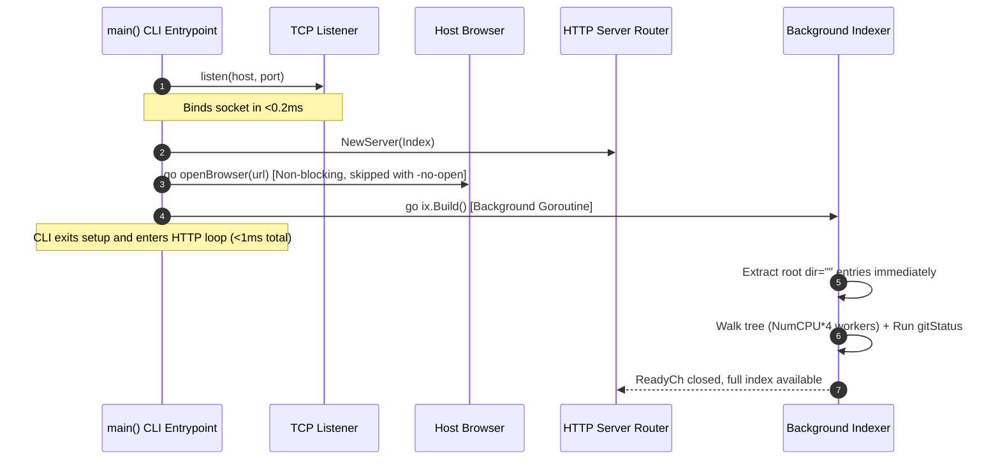

# System Architecture & Runtime Lifecycle

This document describes the high-level architecture, startup pipeline, HTTP server, memory scavenging, and security model of `px1`.

## 1. High-Level Design Principles

px1 is engineered as an ultra-fast, zero-overhead code exploration console. Its architecture is guided by five foundational tenets:

1. Direct, Narrow Editing: px1 writes file content itself — `/api/file/save` and `/api/file/rename` are the only two endpoints that touch disk, gated by an optimistic-concurrency check against the file's mtime/size and a same-origin `localPost` check. There is no general file-management API beyond that (git stage/unstage/commit are the other writes, and they only ever shell out to `git`).
1. Single Static Binary Footprint: All frontend assets (HTML, CSS, JavaScript, icons, themes) are embedded directly into the Go binary at compile time via `go:embed`. px1 requires no Node.js, Python, or Ruby runtime, no external database, and no CGO dependencies — aside from the optional `claude` CLI shell-out for commit-message generation, which fails quietly when that CLI isn't on `PATH`.
1. Sub-Millisecond Responsiveness: The HTTP listener binds, serves the web UI, and opens the default browser in under 1 millisecond. Heavy operations (full directory indexing, git status checks) run asynchronously off the critical path.
1. Stateless in the Workspace: px1 never writes configuration directories, temporary caches, or metadata files (e.g., `.px1/` or `.cache/`) into a workspace. Indexes and caches live in volatile memory, and px1 keeps no state outside the workspace either.
1. Strict Memory Reclamation: Long-lived background processes should not hold idle RAM. When the user finishes a burst of queries, unused pages are proactively returned to the operating system.

## 2. Startup Pipeline (<1 ms Critical Path)

When `px1` is executed in a terminal (e.g., `px1 .` or `px1 main.go:42`), the initialization flow executes as follows. A file target detects its enclosing project repository (or working directory) as the workspace and is passed to the browser with its relative path and optional line number.



### Key Stages in [`main.go`](../../main.go)

1. Target Resolution: Directories become workspace roots. For a file target, its repository or project root is detected as the workspace, and its relative path (with optional line number) is retained for the initial browser tab.
1. Socket Binding: `listen(*host, *port)` binds an ephemeral or user-specified TCP socket immediately, walking forward through ports if the requested one is busy.
1. Instant Root Tree Extraction: Before descending into subdirectories, `ix.Build()` extracts and populates the root directory entries (`dir=""`), publishing them directly to `ix.children[""]`. When the browser makes its initial request to `/api/tree`, it immediately renders the root tree nodes without waiting for the deep repository scan to finish.
1. Non-Blocking Browser Launch: `go openBrowser(url)` spawns the platform-specific browser opener (`xdg-open` on Linux, `open` on macOS, `rundll32` on Windows) in a separate goroutine, unless `-no-open` was passed.
1. Concurrent Tree Walk & Git Status: Indexing runs inside a background goroutine. A dedicated goroutine runs `gitStatus(ix.root)` in parallel with the file walk so that subprocess overhead overlaps the walk rather than adding to it.

### Background Mode (`-d`)

`-d` re-execs the binary as a session-detached child (`daemon.go`/`daemon_unix.go`/`daemon_windows.go`): the parent spawns a copy of itself with a temp status-file path in its environment, the child writes its bound URL to that file right after `listen()` succeeds, and the parent polls for it, prints it, and exits — handing the invoking shell back immediately instead of blocking it for the life of the server. Each detached instance still walks forward from its requested port if busy, so running `-d` against several workspaces just stacks onto the next free port.

## 3. HTTP Server & API Catalog

The server is implemented in [`server.go`](../../server.go) using Go's standard `http.ServeMux`. Every request passes through a centralized `ServeHTTP` wrapper that records activity timestamps and applies pooled Gzip compression when accepted by the client.

### Endpoints Reference

All `POST` endpoints below are gated by `localPost` (see the Security Model section below).

| Endpoint                    | Method | Purpose                                                                 | Response Format                            |
| ---------------------------- | ------ | ----------------------------------------------------------------------- | ------------------------------------------ |
| `/`                          | `GET`  | Serves `web/index.html` (embedded or `-dev` disk copy)                  | `text/html; charset=utf-8`                 |
| `/static/*`                  | `GET`  | Serves bundled JavaScript, CSS, and static assets                       | Asset MIME type                            |
| `/static/themes.css`         | `GET`  | Concatenates all `web/themes/*.css` files in alphanumeric order         | `text/css; charset=utf-8`                  |
| `/api/meta`                  | `GET`  | Workspace metadata                                                       | JSON (`{root, name, files, indexMs, builtAt, ready, git, version}`) |
| `/api/tree`                  | `GET`  | Directory contents for the sidebar file explorer (`?dir=path`)          | JSON (`{dir, children}`)                   |
| `/api/find`                  | `GET`  | Fast fuzzy match against all indexed workspace paths (`?q=...&limit=...`) | JSON (`{results}`)                       |
| `/api/file`                  | `GET`  | Windowed, highlighted source file lines (`?path=...&start=0&count=500`) | JSON (`{path, lang, total, maxCols, start, lines, size, exact, refine, diffAvailable, mtime, editable}`) |
| `/api/close`                 | `GET`  | Evicts a file's cached highlight buffer once its last tab closes         | JSON (`{ok, path}`)                        |
| `/api/raw`                   | `GET`  | Raw, unhighlighted file content (whole-file copy actions, image tabs)   | Raw bytes, `Content-Type` by extension     |
| `/api/highlight`             | `POST` | Live re-tokenizes an edited buffer's content (debounced from `edit.js`) | JSON (`{lines, total, maxCols, lang}`)     |
| `/api/diff`                  | `GET`  | Unified diff of a file's working tree vs. `HEAD`, for the gutter/diff view (`?path=...`) | JSON (`{path, diff, available}`) |
| `/api/gutter`                | `GET`  | Per-line change markers for the code view gutter (`?path=...`)          | JSON (`{added, modified, deleted}`)        |
| `/api/search`                | `GET`  | Full-text/regex workspace search with snippet elision (`?q=...&case=...&word=...&regex=...&glob=...`) | JSON array of file hits |
| `/api/reindex`               | `POST` | Re-runs the index walk and git status on demand (evicts all cached highlight buffers first) | JSON (`{files, indexMs}`) |
| `/api/file/save`             | `POST` | Saves edited content; refused (409, with current on-disk content) if the file changed on disk since it was opened | JSON |
| `/api/file/rename`           | `POST` | Renames/moves a file within the workspace                               | JSON                                       |
| `/api/git/status`            | `GET`  | Every changed file, staged/unstaged split, for the Source Control panel | JSON (`{files, available}`)                |
| `/api/git/diff`              | `GET`  | Staged or unstaged diff of one file (`?path=...&scope=staged\|worktree`) | JSON (`{path, diff, available}`)          |
| `/api/git/stage`             | `POST` | `git add` one file (`?path=...`)                                        | JSON (`{ok, path}`)                        |
| `/api/git/unstage`           | `POST` | `git reset`/`git rm --cached` one file (`?path=...`)                     | JSON (`{ok, path}`)                        |
| `/api/git/discard`           | `POST` | Discard one file's unstaged changes (`git checkout --` or delete if untracked) | JSON (`{ok, path}`)                  |
| `/api/git/stage-all`         | `POST` | Stage a batch of paths in one `git add` call (body: `{paths}`)          | JSON (`{ok, count}`)                       |
| `/api/git/unstage-all`       | `POST` | Unstage a batch of paths in one call (body: `{paths}`)                  | JSON (`{ok, count}`)                       |
| `/api/git/discard-all`       | `POST` | Discard a batch of unstaged files in one call (body: `{paths}`)         | JSON (`{ok, count}`)                       |
| `/api/git/commit`            | `POST` | `git commit -m` with the given message (body: `{message}`)              | JSON (`{ok}`)                              |
| `/api/git/commit-message`    | `POST` | Shells out to the `claude` CLI on staged changes to draft a commit message | JSON (`{message}`)                      |
| `/api/git/sync-status`       | `GET`  | How the current branch compares to its upstream                         | JSON (`{branch, upstream, hasUpstream, ahead, behind}`) |
| `/api/git/push`              | `POST` | `git push`                                                               | JSON (`{ok}`)                              |

## 4. Memory Management & Proactive Scavenging

Even though Go's garbage collector frees unreferenced heap objects rapidly, the Go runtime does not immediately release physical memory pages back to the host operating system. In high-churn CLI sessions (such as searching a 50,000-file repository), the process resident set size (RSS) could appear inflated long after the search completes.

To maintain a lean footprint (~20 MB RSS), `server.go` implements an automatic scavenger:

```go
func (s *Server) scavenge() {
    const idleFor = 15 * time.Second
    tick := time.NewTicker(10 * time.Second)
    defer tick.Stop()
    done := true
    for range tick.C {
        idle := time.Since(time.Unix(0, s.lastReq.Load()))
        if idle < idleFor {
            done = false
            continue
        }
        if done {
            continue
        }
        debug.FreeOSMemory()
        done = true
    }
}
```

### Scavenging Mechanism

- `s.lastReq`: An atomic 64-bit integer tracks the Unix timestamp (in nanoseconds) of the most recent incoming HTTP request.
- When no HTTP traffic has arrived for 15 seconds after an active period, `debug.FreeOSMemory()` is invoked.
- Physical memory pages freed by the GC are surrendered back to the operating system kernel immediately, preventing background memory bloat.

### Gzip Buffer Pooling

To avoid heap allocations on every JSON endpoint response, `gzip.Writer` instances are pooled via `sync.Pool` using `gzip.BestSpeed`:

```go
var gzipPool = sync.Pool{New: func() any {
    w, _ := gzip.NewWriterLevel(io.Discard, gzip.BestSpeed)
    return w
}}
```

## 5. Security Model & Path Sandboxing

Because px1 exposes a local HTTP server that can display source files and interact with local tools, strict boundary constraints are enforced.

### Path Resolution (`safePath`)

Every client-supplied path — for reads (`/api/file`, `/api/raw`, `/api/tree`, `/api/diff`, `/api/gutter`) and for the narrow set of writes (`/api/file/save`, `/api/file/rename`, every `/api/git/*` mutation) — goes through one function, `safePath` (`resolvePath` is a thin alias kept for call-site clarity):

1. Leading slashes and surrounding whitespace are trimmed.
1. The path is cleaned via `filepath.Clean()`.
1. Paths attempting directory traversal (`..`, or an absolute path) are rejected.
1. The cleaned path is joined onto the workspace root and the result must still have that root as a prefix, or it's rejected.

There is no allowlist and no exception: a path can never resolve outside the workspace root. Since px1 dropped LSP-based navigation, there is no longer a legitimate reason for a request to reach outside it.

### Origin Verification for Mutating Requests (`localPost`)

`/api/file/save`, `/api/file/rename`, `/api/highlight`, `/api/reindex`, and every `/api/git/*` write are the only endpoints that change something (disk content or git state). Each is gated by `localPost` (`server.go`) against cross-origin attacks — a malicious website triggering a write via JavaScript `fetch()` while px1 happens to be running:

1. The request method must be `POST`.
1. The `Host` header is validated to ensure it is strictly an IP address (`127.0.0.1`, `[::1]`) or `localhost`. Opened through a hostname instead (a reverse proxy or tunnel domain), writes are refused outright — this is deliberate, see the Security note in [`CLAUDE.md`](../../CLAUDE.md).
1. The request `Origin` header must match the request `Host` header. This prevents DNS-rebinding attacks, where an attacker's domain is pointed at this machine so its `Origin` would otherwise pass an IP/localhost-only check.
