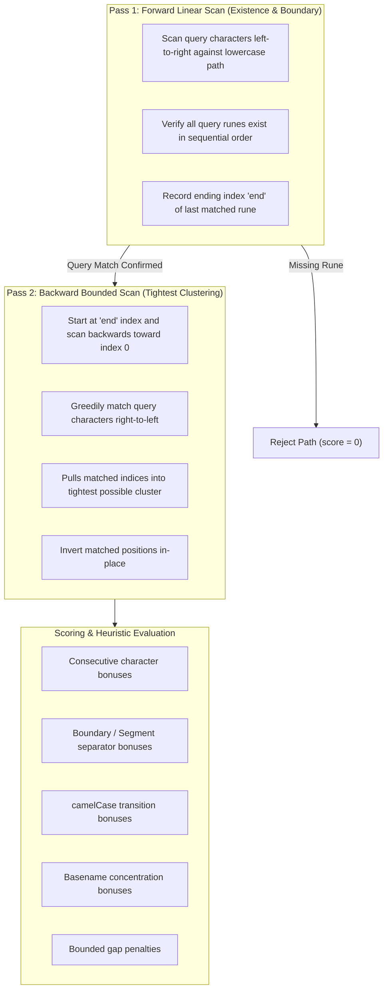

# Fuzzy Path Matching Engine

This document describes the algorithms, scoring heuristics, and concurrency strategies behind px1's ultra-fast fuzzy file finder ([`fuzzy.go`](../../fuzzy.go)).

## 1. The Fuzzy Matching Challenge

Traditional fuzzy matchers (such as Smith-Waterman or Needleman-Wunsch dynamic programming algorithms) achieve high ranking accuracy by evaluating an $O(N \times M)$ alignment matrix (where $N$ is path length and $M$ is query length). However, on large workspaces containing 50,000-100,000 files, evaluating DP matrices for every keystroke introduces noticeable typing latency and burns CPU cycles.

Conversely, naive greedy linear scans run in $O(N)$ time but frequently produce poor match clusters, matching the earliest available character rather than the tightest and most intuitive run.

px1 solves this with a Two-Pass Bounded Search Algorithm:

- It achieves the clustering and ranking accuracy of dynamic programming.
- It operates strictly in $O(N)$ linear time without intermediate allocations.
- It returns ranked results across tens of thousands of paths in sub-millisecond time.

## 2. Two-Pass Bounded Matching Algorithm

The matching logic in `fuzzyScore(q, e, pos)` operates in two discrete passes:



### Step-by-Step Execution

1. Pass 1 (Forward Scan): Evaluates whether every rune in query `q` exists sequentially in `e.lower`. Records the index `end` where the final rune was located. If the scan reaches the end of the path without exhausting the query, the path is immediately rejected ($O(\text{prefix})$ fast rejection).
1. Pass 2 (Backward Scan from `end`): Starting from `end`, scans backward toward 0, matching query characters in reverse order. Because it starts from the earliest valid termination point and moves backward, it naturally converges on the tightest possible cluster of matching runes. Matched byte offsets are appended to a reusable slice `pos` and flipped in-place.

## 3. Weighted Scoring Matrix

Once the optimal character positions `pos` are determined, the path is scored according to human developer navigation patterns:

| Criterion              | Score Delta     | Rationale                                                                                                               |
| ---------------------- | --------------- | ----------------------------------------------------------------------------------------------------------------------- |
| Consecutive Run        | `+12`           | Characters typed together (e.g. `ctrl` matching `controller`) should score significantly higher than scattered characters. |
| Boundary Character     | `+16`           | Characters immediately following `/`, `_`, `-`, `.`, space, or `@` indicate word boundaries (e.g., `gs` matching `git_status`). |
| camelCase Transition   | `+14`           | Matches on uppercase letters in mixed-case names (e.g., `fb` matching `FooBar`).                                       |
| Hit in Basename        | `+14`           | Matches inside the file's filename are penalized far less than matches buried deep in directory prefix names.          |
| Exact Basename Match   | `+40`           | If the matched positions exactly encompass the entire basename, massive priority is awarded.                            |
| Gap Penalty            | `-min(gap, 12)` | Bounded penalty for non-consecutive gaps between matched characters.                                                    |
| Path Length Penalty    | `-len(path) / 4`| Prevents deeply nested files from outranking shorter, top-level canonical files.                                        |

```go
func isBoundary(b byte) bool {
    switch b {
    case '/', '_', '-', '.', ' ', '@':
        return true
    }
    return false
}
```

## 4. Multi-Core Parallel Query Slicing

For smaller repositories (<4,000 files), single-threaded execution easily completes in under 1 ms. However, when navigating repositories like Kubernetes or the Linux Kernel (25,000-100,000 files), query evaluation is automatically partitioned across CPU cores.

```go
func (ix *Index) Find(q string, limit int) []FuzzyResult {
    files := ix.Files()
    if len(files) == 0 || q == "" {
        return nil
    }

    // Partition across CPU workers for large indices
    if len(files) >= 4000 {
        workers := runtime.NumCPU()
        chunkSize := (len(files) + workers - 1) / workers
        // Workers evaluate chunks concurrently...
    }
}
```

### Concurrency Pipeline

1. The `files` slice is partitioned into equal chunks across `runtime.NumCPU()` workers.
1. Each worker allocates a local result buffer and evaluates its chunk independently without lock contention.
1. Once all workers finish, top candidate slices are merged and sorted in-place.
1. The sorted results are capped at `limit` (typically 50 results) and returned to the client as JSON.
